# Partial teardown of F(x)tec Pro1

## Disclaimer

Doing any of the stuff listed here voids your warranty. And I explicitly don't
take any responsibility for anything that you do after reading this.

## Tools

* Small philips screwdriver
    * It needs to have at least 25mm long tip in order to reach screws that attach the hinge
    * If it's marked as PH000 or PH00, it should work.
* Container for screws
    * They're tiny and you don't want them flying around. I used a magnetic mat for this.
* Tweezers
* Thin prying tools
    * And pieces of aluminum can to assist

## Step 0

Power off the phone and remove any removabale parts:

* SIM tray
* Anything in USB port
* Anything in headphone jack

## Step 1: screen

Slide out the keyboard, turn the phone over, remove these 5 black stickers to revel screw heads:

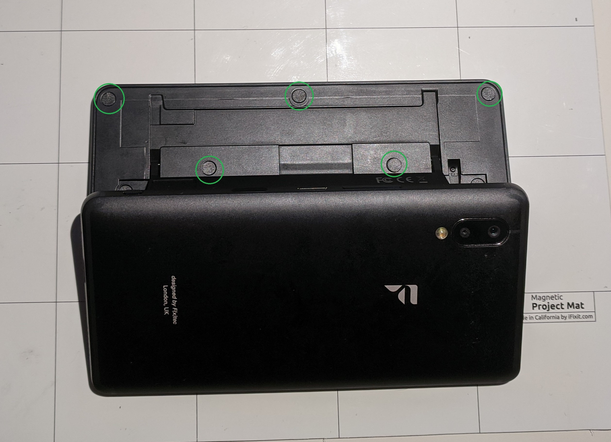

I used a tip of hobby knife to peel the edge a bit, and then followed up with tweezers to completely remove the sticker:

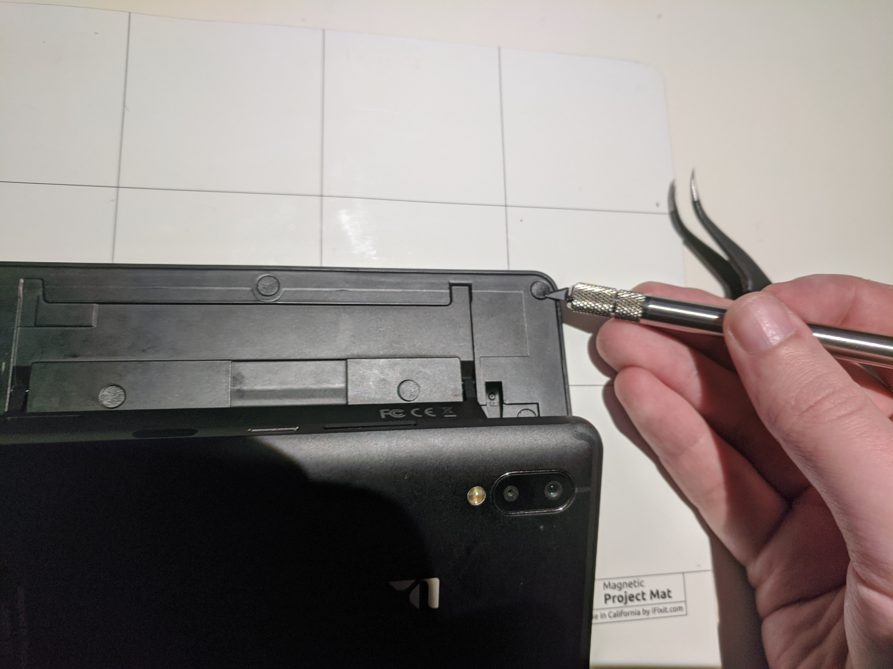

After you've set all 5 stickers aside, simply remove the screws.

Now the screen panel is held in place only by a few clips, marked here:

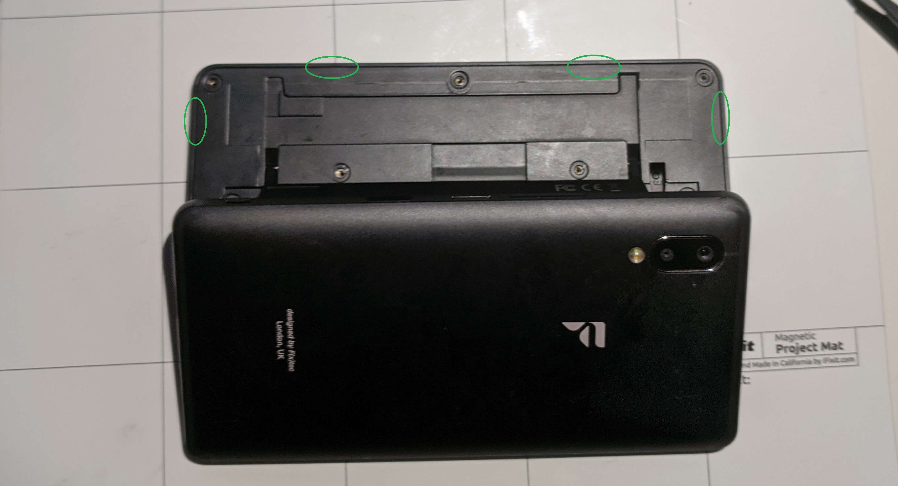

Gap between screen panel and backplate is quite thin, so to safely unclip it, take a piece of aluminum can, insert it like in the picture below and slide it around the corner:

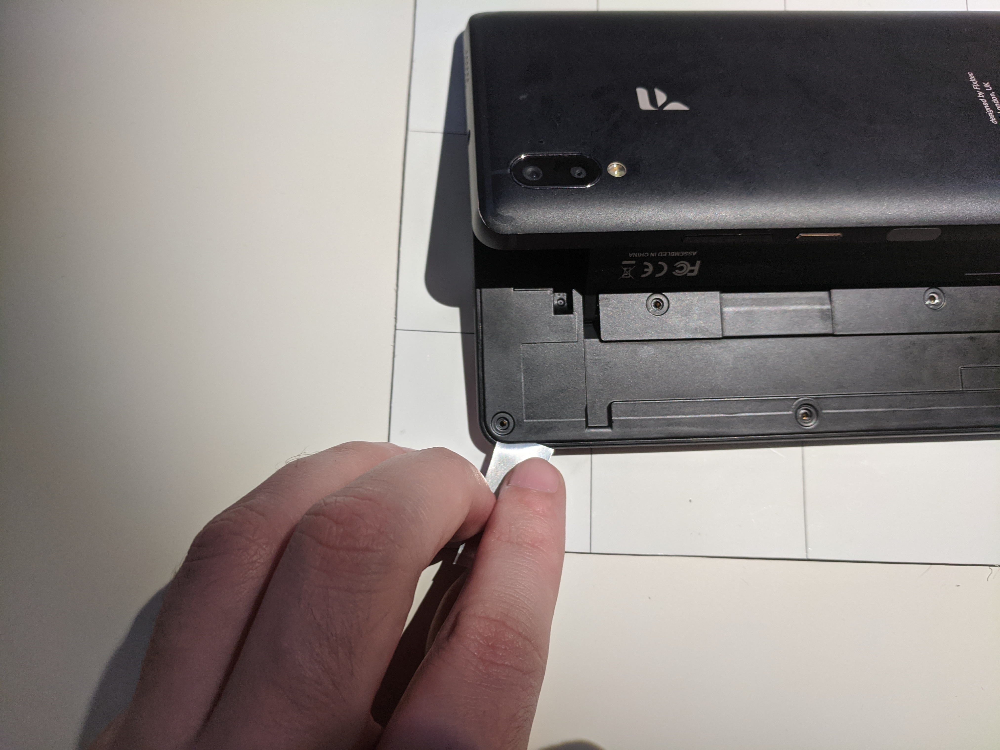

That should free the clip on that side. From there, insert a more handy prying tool (which you now have space for) and work your way along the long edge. Be gentle, these clips don't require much force.

Once you get all 4 clips undone, the screen fill come off and you'll be able to reach screen and camera cables:

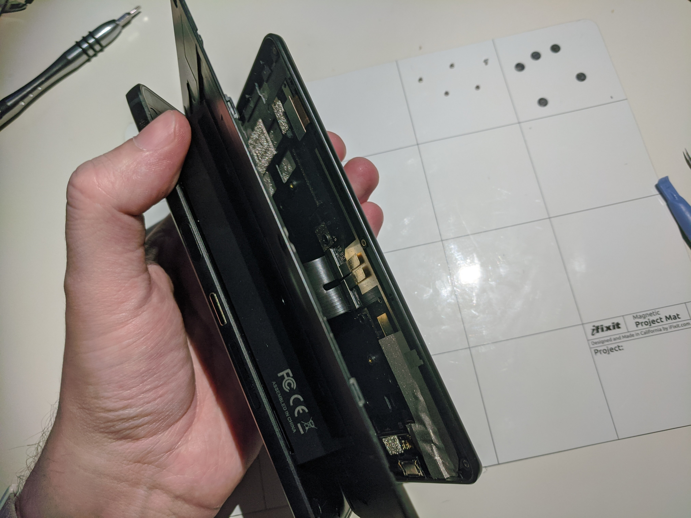

Carefully disconnect them to completely separate screen panel from the rest of the phone:

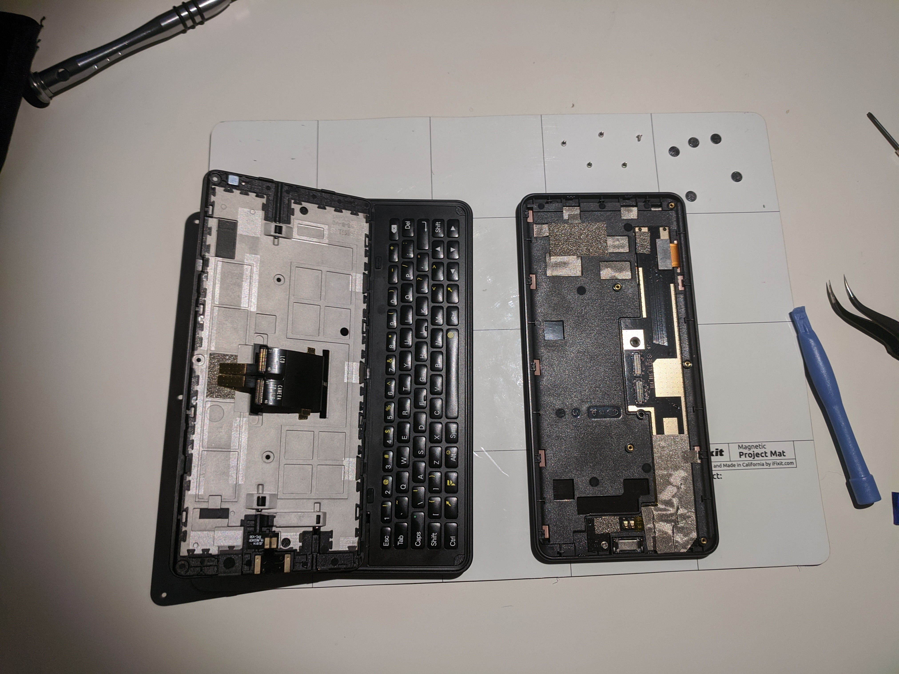

## Step 2: screen backplate

It attaches to the hinge parts with 3 screws that double as hinge axles:

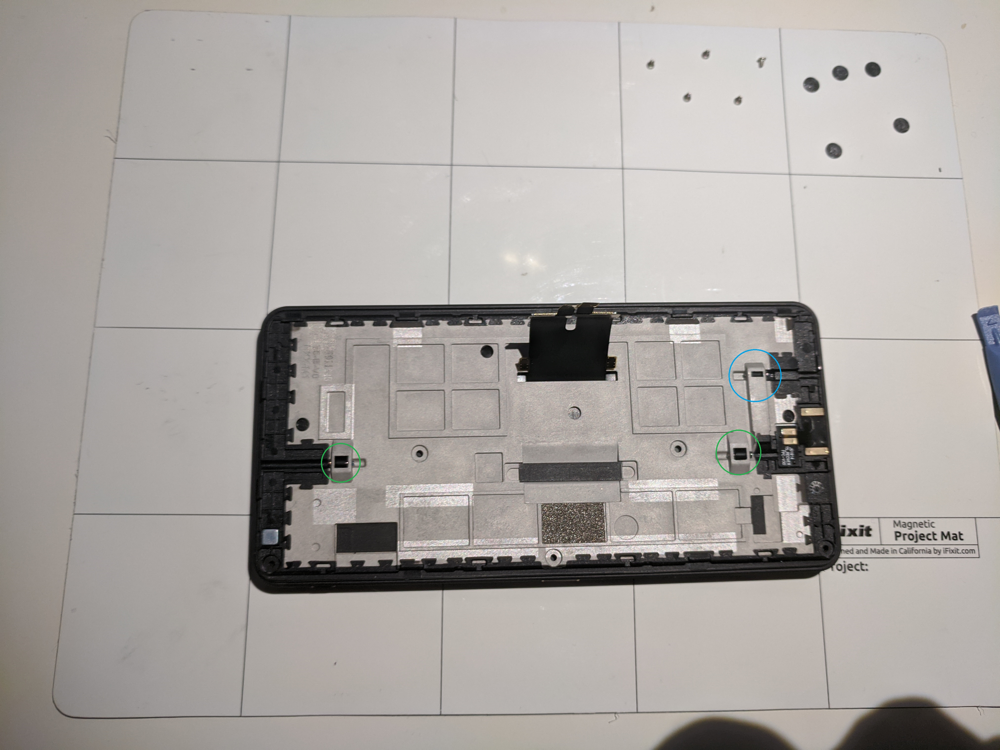

This is the part where you need a screwdriver with a long tip. If you try to reach the screws at an angle, you'll most likely just damage them. So you need to basically put screwdriver in the channel next to a screw and operate it from there.

After you unscrew them, you'll need tweezers to pull them out. The one marked in blue is a bit stubborn due to the shape of it's channel - you might want to leave it for last and lift the opposite edge of the backplate up a bit, to give it more room.

Once you remove all 3 screws, you can just lift the plate up to remove it.

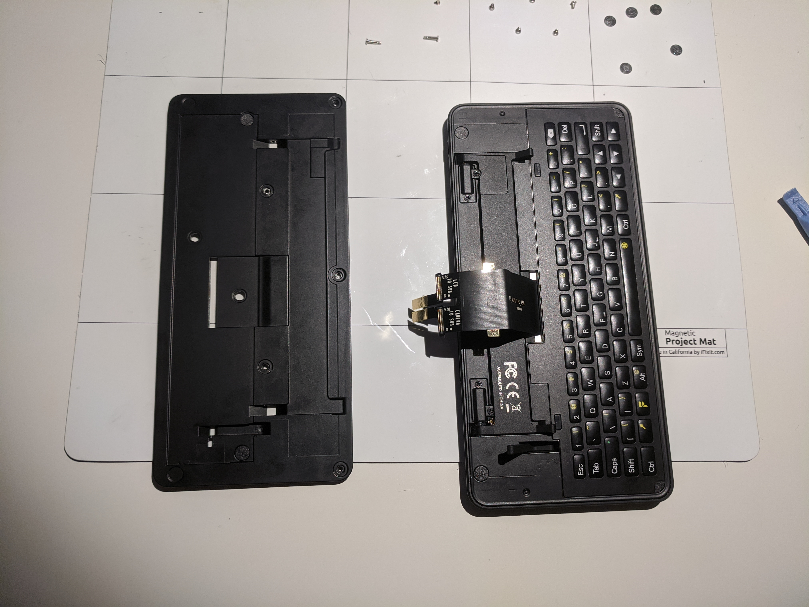

## Step 3: phone body

From here, things get a bit complicated. Main phone body is held in the back casing by 5 screws:

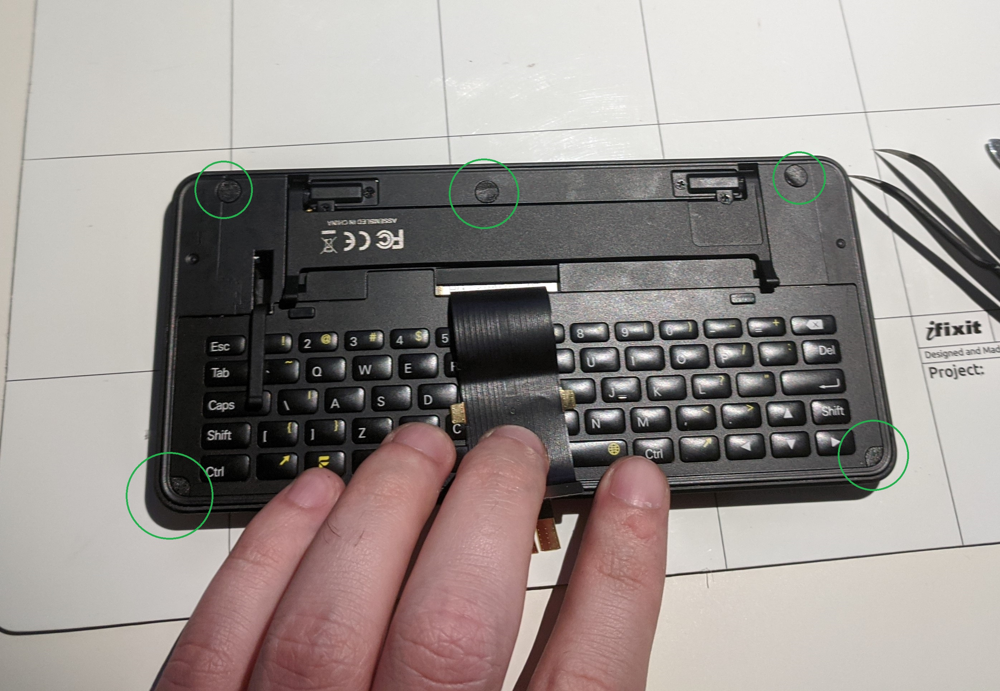

You can safely ignore the hinge, it's only attached to the main body, not the back casing.

**WARNING**: double-check that you removed the SIM tray. If you didn't, proceeding will cause catastrophic damage to your phone.

**WARNING**: do not pull the phone body out as soon as you release the clips - fingerprint sensor's cable is way too short and a weak spot where it will get torn if you pull it too far.

Now comes the part where I don't have a good way in. Phone body is still held inside the casing tightly by a few clips.

TODO: picture with locations of all clips.

I managed to get in, but it left minor cosmetic damage. Here's what I did:

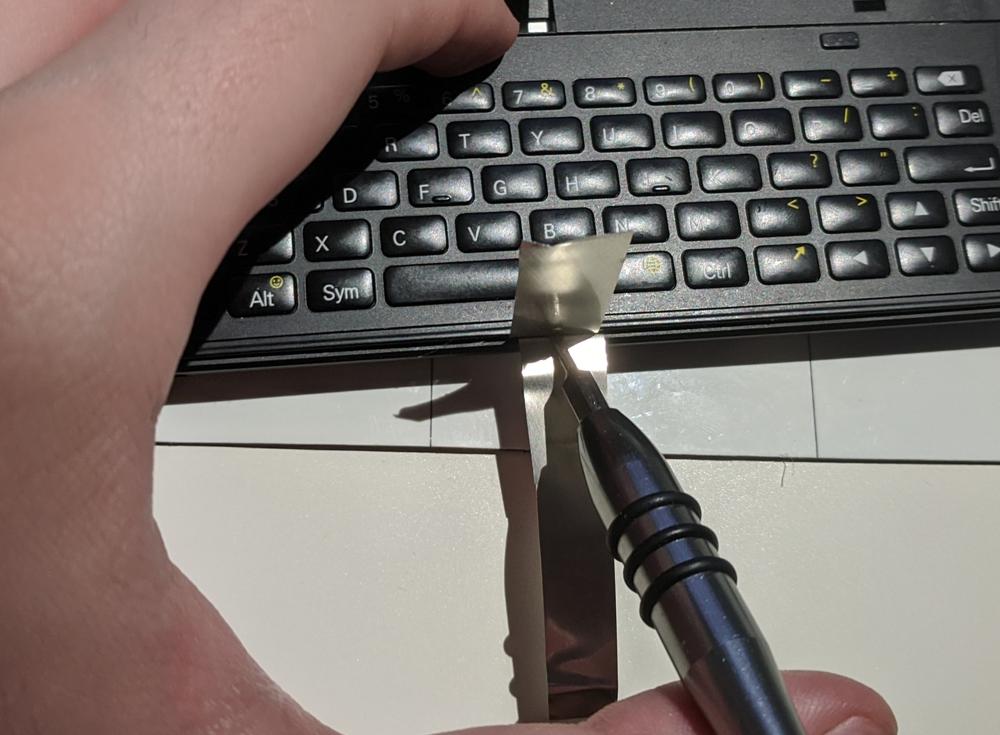

That's about the only spot where I managed to insert shims deep enough. Once you get 2 pieces of aluminum inserted there - put a prying tool between them and use it as a lever to push the phone body up. It requires quite a bit of force, so be extremely careful and increase the pressure very gradually.

In retrospect, I should've used a prying tool with a wider blade: I was using a small flat screwdriver, which pierced the shims and caused aforementioned cosmetic damage.

Once it's fully unclipped, disconnect the fingerprint scanner while holding both parts as close together as possible. On the picture below I'm pulling them apart way too far, you can access the connector with a much more narrow opening. In the red circle is the weak spot of the cable: pull it too far and you'll start tearing apart the cable.

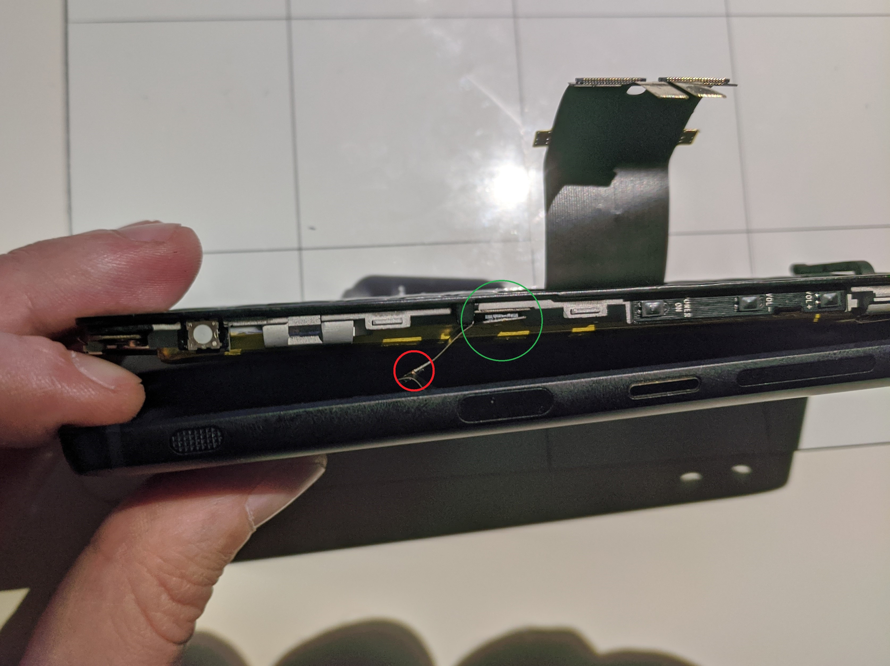

After you disconnect the fingerprint scanner, you can simply take out the phone body:

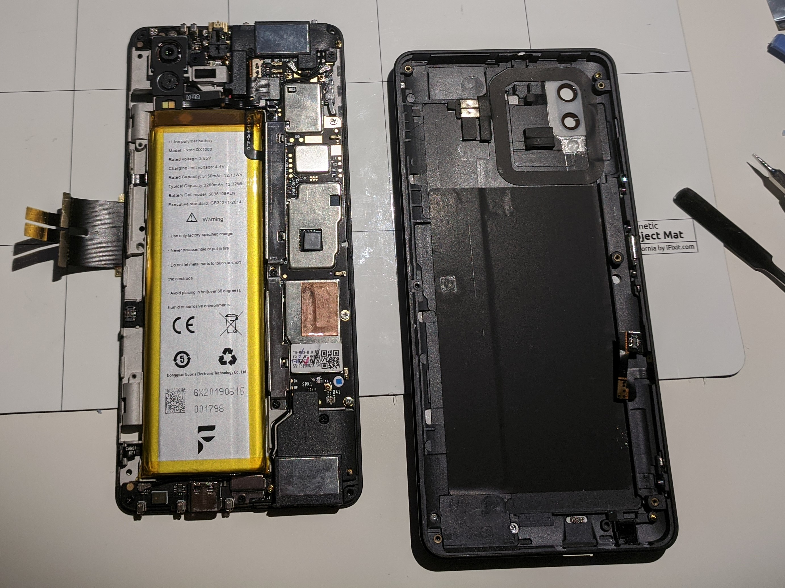

This is as far as I'm willing to go for now. From the looks of it, main board assembly is held together only by screws and some adhesive for the battery, so taking components out shouldn't be a problem.
